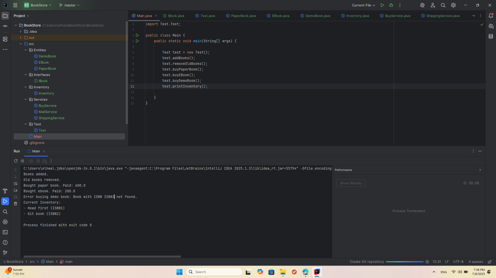

#  Quantum Bookstore Project

This is a Java-based console application simulating an online bookstore. It supports managing and purchasing different types of books:
- Paper Books (physical copies)
- EBooks (digital downloads)
- Demo Books (not for sale)

---

## Project Structure

``` 
src/
│
├── Entities/
│ ├── PaperBook.java
│ ├── Ebook.java
│ ├── DemoBook.java
|
├── interfaces/
│ ├── IBook.java
│
|
├── Inventory/
│ ├── Inventory.java
|
├── services/
| |── BuyService.java
│ ├── MailService.java
│ └── ShippingService.java
│
|── Test/
| |── Test.java
|
└── Main.java
 ```
 
---

## Features

- Add different types of books to inventory.
- Remove outdated books older than a specific number of years.
- Purchase books by ISBN.
- PaperBooks are sent via a `ShippingService`.
- EBooks are sent via a `MailService`.
- DemoBooks cannot be purchased.

---


## Test




---

## To Run

1. Clone or download this project.
2. Open it in your Java IDE.
3. Run `Main.java`.

---
